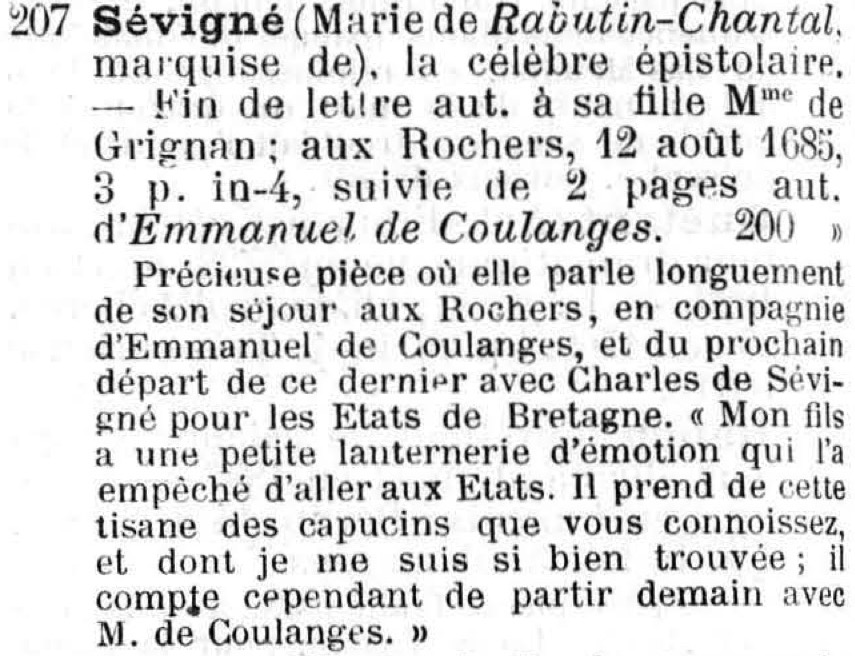
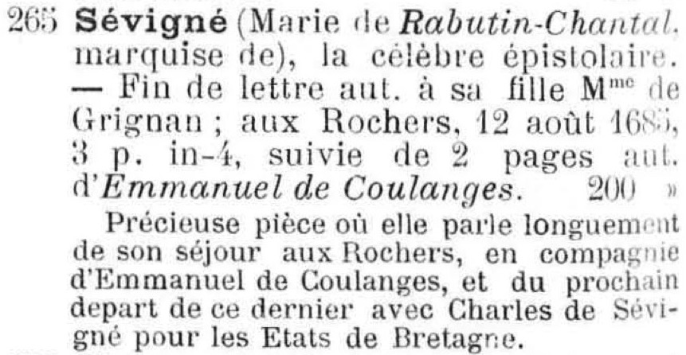
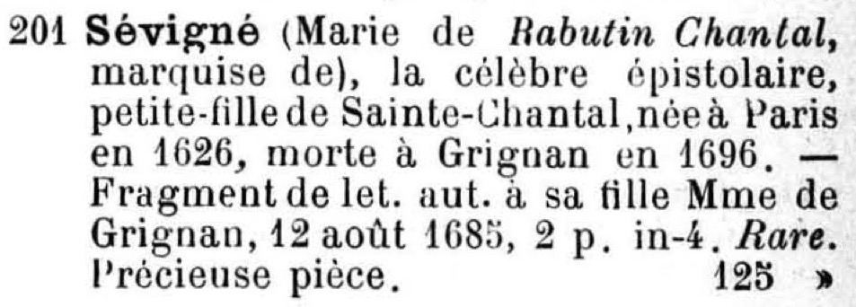

# OPERATION RECONCILIATION

Reconciliation of manuscript sale catalogues entries

# 1. Objective
Manuscript sale catalogues propose list of manuscript for sale. A same manuscript can be sold multiple times.




Our objective is to detect similar entries.

# 2. Workflow

## 2.1. Clean the data

Entries of catalogues look like the following:

```xml
<item n="80" xml:id="CAT_000146_e80">
   <num>80</num>
   <name type="author">Cherubini (L.),</name>
   <trait>
      <p>l'illustre compositeur</p>
   </trait>
   <desc>L. a. s.; 1836, 1 p. in-8. 12</desc>
</item>
```

Most of the reconciliation process uses data from the `<desc>` element of our xml files. We therefore need to correct typos to ease further post-processing, _e.g._
  * `L. a s.` -> `L. a. s.`
  * `in4` -> `in-4`
  * `1 /2` -> `1/2`
The `clean-xml.py` script [available here](https://github.com/katabase/reconciliation/tree/master/input) tackles this problem:
  * `python clean-xml.py -f FILENAME` processes one single file
  * `python clean-xml.py -d DIRECTORY` processes all the files contained in a directory

## 2.2. Information retrieval in the `desc`

We need to extract data from the `desc` and transform

```xml
<item n="80" xml:id="CAT_000146_e80">
   <num>80</num>
   <name type="author">Cherubini (L.),</name>
   <trait>
      <p>l'illustre compositeur</p>
   </trait>
   <desc>L. a. s.; 1836, 1 p. in-8. 12</desc>
</item>
```

into

```xml
<item n="80" xml:id="CAT_000146_e80">
   <num>80</num>
   <name type="author">Cherubini (L.),</name>
   <trait>
      <p>l'illustre compositeur</p>
   </trait>
   <desc><term>L. a. s.</term>; <date>1836</date>,
   <measure type="length">1 p.</measure> <measure type="length">in-8</measure>.
   <measure type="price" quantity="12">12</desc>
</item>
```

To carry this task we use the `extractor.py` [available here](https://github.com/katabase/reconciliation/tree/master/script).

### Cite this repository
Matthias Gille Levenson and Simon Gabay (éd.), _Operation Reconciliation: Reconciliation of Manuscript Sale Catalogues Entries_, Genève: Université de Genève, Lyon: Ecole normale supérieure de Lyon, 2020, [https://github.com/katabase/reconciliation](https://github.com/katabase/reconciliation).

### Licence
<a rel="license" href="http://creativecommons.org/licenses/by-sa/4.0/"></a><br />This work is licensed under a <a rel="license" href="http://creativecommons.org/licenses/by-sa/4.0/">Creative Commons Attribution 4.0 International Licence</a>.
